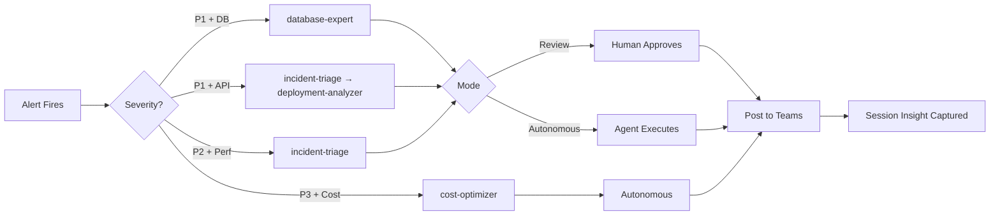
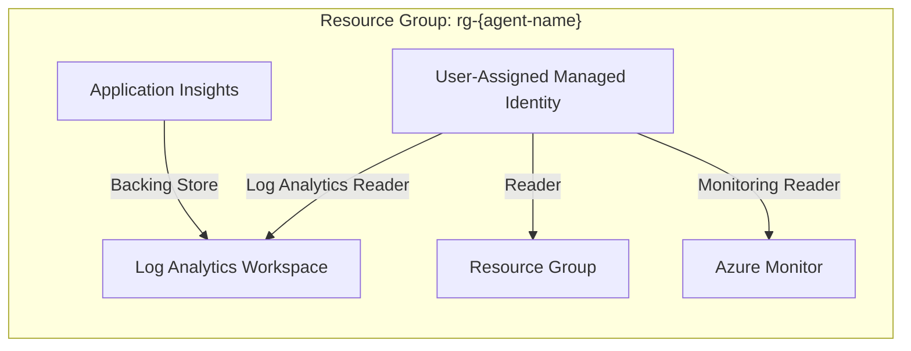

# Architecture Guide

## Agent Topology

```mermaid
graph TB
    subgraph "Triggers"
        AM[Azure Monitor Alerts]
        PD[PagerDuty]
        ST1[Daily Health Check ⏰]
        ST2[Cost Anomaly ⏰]
        ST3[Security Review ⏰]
        ST4[Deploy Verification ⏰]
        ST5[Weekly SLA Report ⏰]
    end

    subgraph "Agent Canvas"
        TRIAGE[🔀 Incident Triage]
        DB[🗄️ Database Expert]
        AKS[☸️ AKS Expert]
        SEC[🔒 Security Auditor]
        DEP[🚀 Deployment Analyzer]
        COST[💰 Cost Optimizer]
    end

    subgraph "Skills"
        S1[AKS Troubleshooting]
        S2[Database Diagnostics]
        S3[Deployment Rollback]
        S4[Certificate Renewal]
        S5[Cost Analysis]
    end

    subgraph "Tools"
        T1[Azure CLI Read/Write]
        T2[kubectl Commands]
        T3[KQL Queries]
        T4[Python Tools]
        T5[App Insights Query]
        T6[Azure Resource Graph]
    end

    subgraph "Connectors"
        GH[GitHub]
        ADO[Azure DevOps]
        TEAMS[Teams]
        OL[Outlook]
        DD[Datadog MCP]
        GF[Grafana MCP]
    end

    subgraph "Knowledge"
        KB[Knowledge Base]
        MEM[Agent Memory]
        SI[Session Insights]
    end

    AM --> TRIAGE
    PD --> TRIAGE
    TRIAGE --> DB
    TRIAGE --> AKS
    TRIAGE --> SEC
    TRIAGE --> DEP
    TRIAGE --> COST

    ST1 --> AKS
    ST2 --> COST
    ST3 --> SEC
    ST4 --> DEP
    ST5 --> OL

    DB --> S2
    AKS --> S1
    DEP --> S3
    SEC --> S4
    COST --> S5

    DB --> T3
    DB --> T5
    AKS --> T2
    AKS --> T1
    DEP --> T1
    SEC --> T6
    COST --> T4

    TRIAGE --> TEAMS
    DEP --> GH
    SEC --> ADO
    COST --> OL

    DB --> KB
    AKS --> MEM
    TRIAGE --> SI
```

## Response Plan Routing

```mermaid
flowchart LR
    A[Alert Fires] --> B{Severity?}
    B -->|P1 + DB| C[database-expert]
    B -->|P1 + API| D[incident-triage → deployment-analyzer]
    B -->|P2 + Perf| E[incident-triage]
    B -->|P3 + Cost| F[cost-optimizer]
    C --> G{Mode}
    D --> G
    E --> G
    F --> H[Autonomous]
    G -->|Review| I[Human Approves]
    G -->|Autonomous| J[Agent Executes]
    I --> K[Post to Teams]
    J --> K
    H --> K
    K --> L[Session Insight Captured]
```

## Scheduled Task Timeline

```mermaid
gantt
    title Daily Automation Schedule (UTC)
    dateFormat HH:mm
    axisFormat %H:%M

    section Morning
    Security Review (Mon)    :07:00, 30min
    Daily Health Check       :08:00, 15min
    Cost Anomaly Detection   :09:00, 15min

    section Continuous
    Deploy Verification      :crit, 00:00, 1440min

    section End of Week
    Weekly SLA Report (Fri)  :16:00, 30min
```

## Infrastructure Components (Deployed by Bicep)

```mermaid
graph LR
    subgraph "Resource Group: rg-{agent-name}"
        LA[Log Analytics Workspace]
        AI[Application Insights]
        MI[User-Assigned Managed Identity]

        AI -->|Backing Store| LA
        MI -->|Reader| RG[Resource Group]
        MI -->|Log Analytics Reader| LA
        MI -->|Monitoring Reader| MON[Azure Monitor]
    end
```
