# Azure SRE Agent — Visual Portal Guide

> **Last updated:** May 2026 | **Portal:** [sre.azure.com](https://sre.azure.com) | **Docs:** [learn.microsoft.com/azure/sre-agent](https://learn.microsoft.com/en-us/azure/sre-agent/)
>
> This guide provides a **visual walkthrough of every section** of the Azure SRE Agent portal, with screenshots taken from a live production environment. Each section includes what it does, how to configure it, and how it maps to config files in this repository.

---

## Table of Contents

1. [Agent Canvas — Workflow Designer](#1-agent-canvas--workflow-designer)
2. [Connectors](#2-connectors)
3. [Knowledge Sources](#3-knowledge-sources)
4. [Skill Builder](#4-skill-builder)
5. [Incident Platform](#5-incident-platform)
6. [Incident Response Plans](#6-incident-response-plans)
7. [HTTP Triggers](#7-http-triggers)
8. [Plugins](#8-plugins)
9. [Hooks](#9-hooks)
10. [Scheduled Tasks](#10-scheduled-tasks)
11. [Capabilities — Tools](#11-capabilities--tools)
12. [Capabilities — Skills](#12-capabilities--skills)
13. [Monitor — Session Insights](#13-monitor--session-insights)
14. [Builder Navigation Overview](#14-builder-navigation-overview)

---

## 1. Agent Canvas — Workflow Designer

The **Agent Canvas** is the visual orchestration surface for your SRE Agent. It shows how agents, triggers, and handoffs connect to form end-to-end incident response workflows.

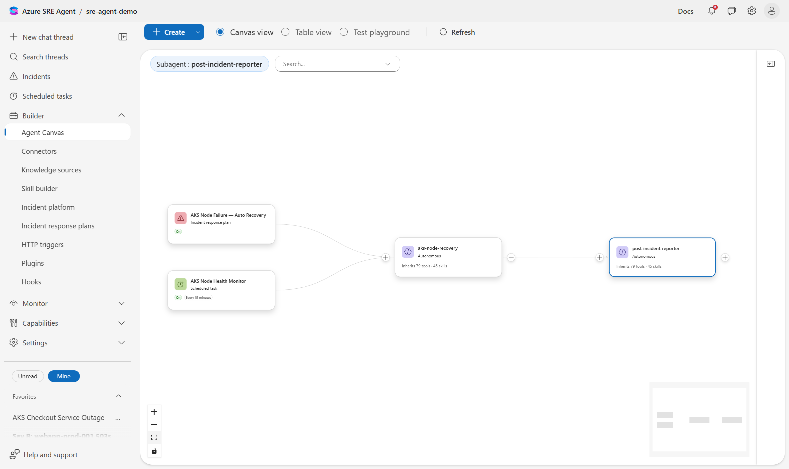

### What You See

The canvas displays a **React Flow** diagram with:
- **Trigger nodes** (left side) — Incident Response Plans and Scheduled Tasks that activate the agent
- **Agent nodes** (center) — Custom agents with their instructions and capabilities
- **Handoff nodes** (right side) — Downstream agents that receive control after the primary agent completes

### Our Demo Workflow

In the screenshot above, you can see the complete workflow we built:

| Node | Type | Description |
|------|------|-------------|
| **AKS Node Failure — Auto Recovery** | Incident Response Plan (trigger) | Fires on Sev0/Sev1 incidents with "AKS" or "node" in the title |
| **AKS Node Health Monitor** | Scheduled Task (trigger) | Runs every 15 minutes to proactively check node health |
| **aks-node-recovery** | Custom Agent (handler) | 5-phase recovery: Assess → Stabilize → Recover → Verify → Communicate |
| **post-incident-reporter** | Custom Agent (handoff) | Generates reports, sends Teams notifications, creates follow-up work items |

### AKS Node Recovery Agent — Close-Up

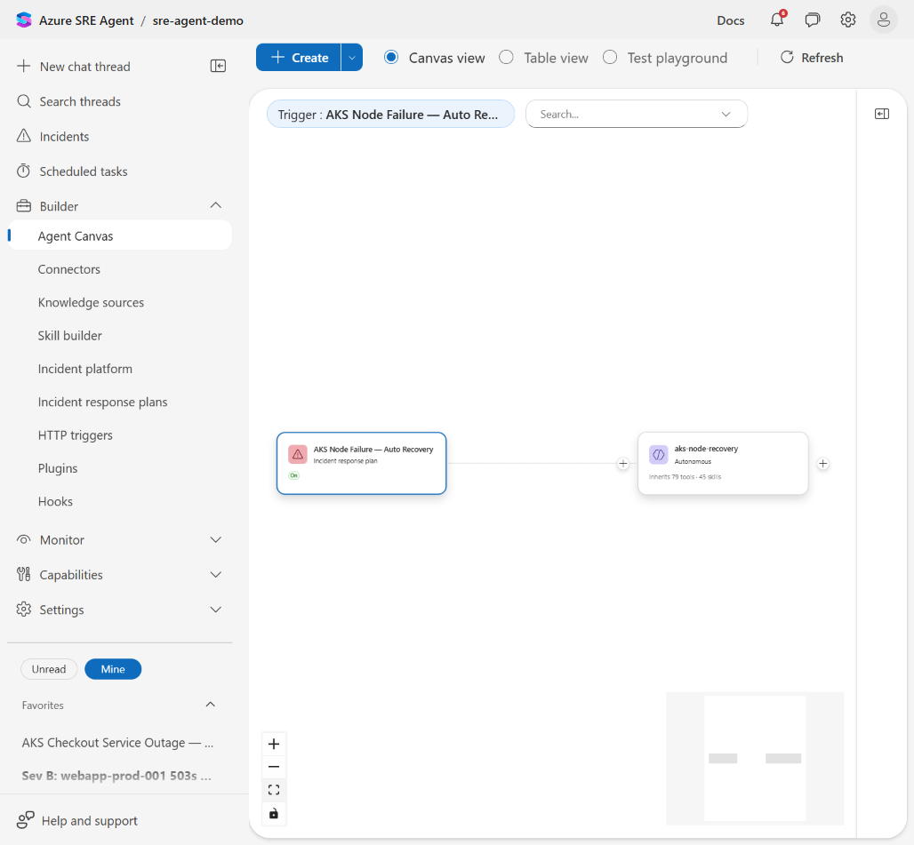

This close-up shows the **aks-node-recovery** agent node on the canvas. Notice:
- The **left connector** (⊕) links to triggers (incident response plans, scheduled tasks) or upstream subagents
- The **right connector** (⊕) links to downstream handoff agents
- The agent card shows the agent name and type

### Canvas Views

The Agent Canvas has three views accessible via tabs at the top:
- **Canvas** — Visual workflow diagram (shown above)
- **Table** — Tabular list of all agents with their configuration
- **Test playground** — Interactive testing surface to simulate agent behavior

### Workflow Overview

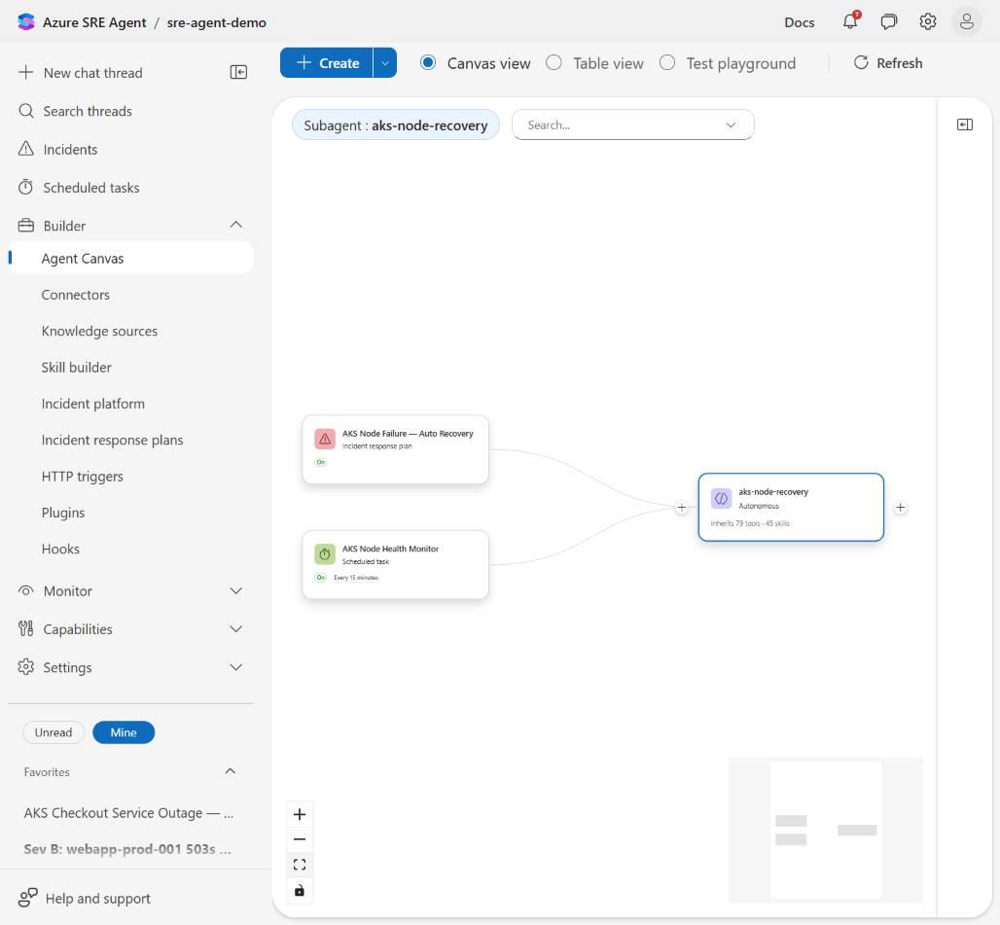

This wider view shows the full canvas with the navigation sidebar visible. The workflow chain is:

```
[Incident/Schedule Trigger] → [aks-node-recovery] → [post-incident-reporter]
```

### 📁 Repo Mapping

| Portal Element | Repo File |
|---------------|-----------|
| aks-node-recovery agent | `agent/custom-agents/aks-node-recovery.yaml` |
| post-incident-reporter agent | `agent/custom-agents/post-incident-reporter.yaml` |
| All custom agent definitions | `agent/custom-agents/*.yaml` |

---

## 2. Connectors

**Connectors** integrate your SRE Agent with external services — notification platforms, telemetry sources, code repositories, and more.

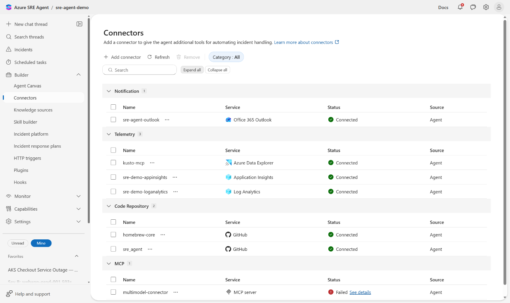

### What You See

The connectors page shows a categorized grid of available integrations:

| Category | Connectors |
|----------|------------|
| **Notification** | Microsoft Teams, Outlook, Webhook |
| **Telemetry** | Datadog (MCP), Grafana (MCP) |
| **Code Repository** | GitHub, Azure DevOps |
| **Other** | ServiceNow, PagerDuty, Jira, Custom MCP |

### How to Configure

1. Navigate to **Builder > Connectors**
2. Click the connector card (e.g., "GitHub")
3. Fill in the required fields:
   - **API URL** / **Base URL**
   - **Authentication** (PAT token, OAuth, API Key)
   - **Organization/Repo** scoping
4. Click **Save** to activate

### Important Notes

- **MCP connectors** (Datadog, Grafana) use the Model Context Protocol — they require an MCP server endpoint
- **Notification connectors** (Teams, Outlook) need Microsoft Graph API permissions
- **Code Repository connectors** enable the agent to read PRs, commits, and create issues

### 📁 Repo Mapping

| Portal Element | Repo File |
|---------------|-----------|
| GitHub connector template | `agent/connectors/github.yaml` |
| Azure DevOps connector | `agent/connectors/azure-devops.yaml` |
| PagerDuty connector | `agent/connectors/pagerduty.yaml` |
| ServiceNow connector | `agent/connectors/servicenow.yaml` |
| Teams connector | `agent/connectors/teams.yaml` |
| Outlook connector | `agent/connectors/outlook.yaml` |
| Datadog MCP connector | `agent/connectors/datadog-mcp.yaml` |
| Grafana MCP connector | `agent/connectors/grafana-mcp.yaml` |

---

## 3. Knowledge Sources

**Knowledge Sources** allow you to upload documents, link web pages, and connect repositories that the agent uses as context during investigations.

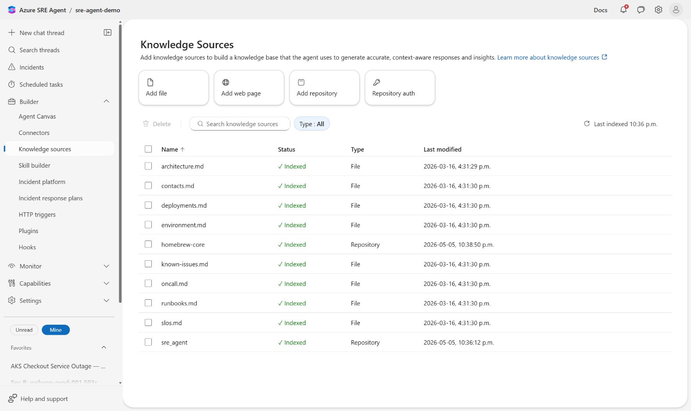

### What You See

The knowledge sources page displays all uploaded/linked knowledge items. Sources can be:

| Source Type | Description | Example |
|------------|-------------|---------|
| **Files** | Uploaded markdown, PDF, or text documents | Runbooks, architecture docs, team contacts |
| **Web Pages** | Linked URLs the agent can reference | Internal wiki pages, Azure status page |
| **Repositories** | Connected Git repos for code context | Your application's source code |

### How to Configure

1. Navigate to **Builder > Knowledge sources**
2. Click **+ Add source**
3. Choose the source type (File upload, Web page URL, or Repository)
4. For files: drag-and-drop or browse to upload `.md`, `.pdf`, `.txt` files
5. For web pages: paste the URL and optionally set a refresh schedule
6. For repositories: connect via the GitHub/ADO connector

### Best Practices

- Upload an **overview.md** that gets loaded into every conversation — this gives the agent persistent context about your environment
- Include **team contacts** so the agent knows who to escalate to
- Add **runbooks** so the agent can follow established procedures
- Keep documents **focused and well-structured** — the agent retrieves relevant sections via semantic search

### 📁 Repo Mapping

| Portal Element | Repo File |
|---------------|-----------|
| Overview (loaded in every chat) | `agent/knowledge/overview.md` |
| Team contacts | `agent/knowledge/team.md` |
| Architecture docs | `agent/knowledge/architecture.md` |
| Deployment procedures | `agent/knowledge/deployment.md` |
| Auth & security guide | `agent/knowledge/auth.md` |
| Debugging playbook | `agent/knowledge/debugging.md` |
| Log analysis guide | `agent/knowledge/logs.md` |
| Database failover runbook | `agent/knowledge/runbooks/database-failover.md` |
| AKS scaling runbook | `agent/knowledge/runbooks/aks-scaling.md` |
| App Service troubleshooting | `agent/knowledge/runbooks/app-service-troubleshooting.md` |
| Incident escalation | `agent/knowledge/runbooks/incident-escalation.md` |

---

## 4. Skill Builder

The **Skill Builder** lets you create custom skills — packaged capabilities that combine instructions, tools, and knowledge into reusable modules.

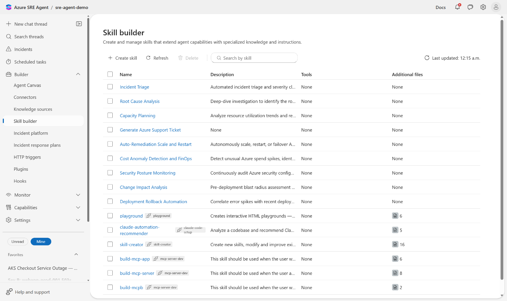

### What You See

The skill builder page shows:
- A list of your custom skills (if any exist)
- A **+ Create skill** button to build new ones
- Each skill has a name, description, and associated tools

### How Skills Work

A skill consists of:
1. **SKILL.md** — A markdown file with step-by-step instructions the agent follows
2. **Attached tools** — KQL queries, Python scripts, or HTTP tools the skill can invoke
3. **Metadata** — Name, description, and category tags

### Creating a Skill

1. Navigate to **Builder > Skill builder**
2. Click **+ Create skill**
3. Enter a name and description
4. Write or paste the skill instructions (markdown format)
5. Optionally attach tools from the tool library
6. Click **Save**

### 📁 Repo Mapping

| Portal Element | Repo File |
|---------------|-----------|
| AKS Troubleshooting skill | `agent/skills/aks-troubleshooting/SKILL.md` |
| Database Diagnostics skill | `agent/skills/database-diagnostics/SKILL.md` |
| Deployment Rollback skill | `agent/skills/deployment-rollback/SKILL.md` |
| Certificate Renewal skill | `agent/skills/certificate-renewal/SKILL.md` |
| Cost Analysis skill | `agent/skills/cost-analysis/SKILL.md` |

---

## 5. Incident Platform

The **Incident Platform** connects your SRE Agent to your incident management system. Only **one platform** can be active at a time.

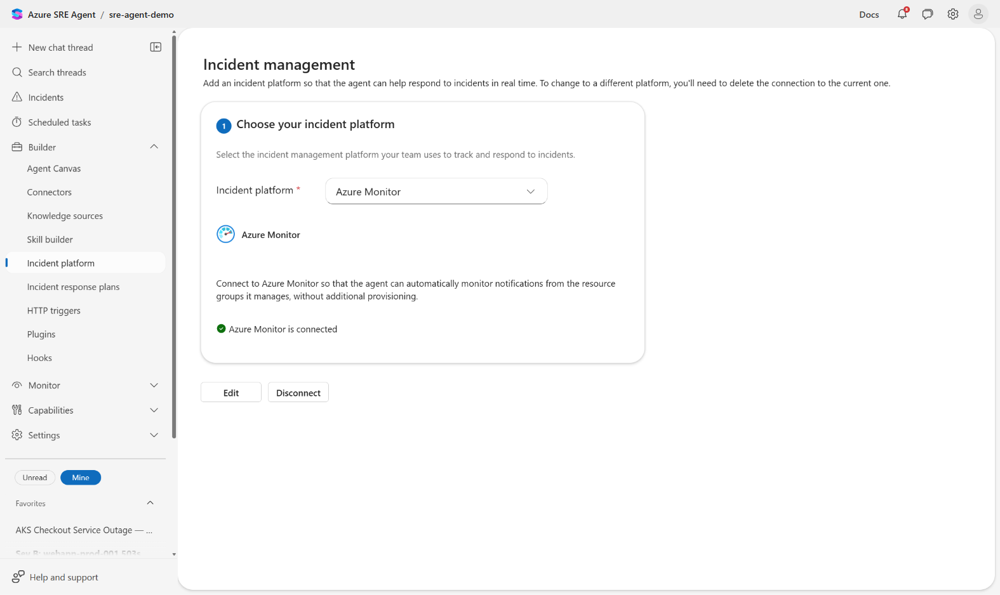

### What You See

The incident platform page shows the available integrations:

| Platform | Description |
|----------|-------------|
| **Azure Monitor** | Native Azure alerting — connects to Action Groups and alert rules |
| **PagerDuty** | Third-party incident management with on-call schedules |
| **ServiceNow** | Enterprise ITSM platform integration |

### How to Configure

1. Navigate to **Builder > Incident platform**
2. Select your platform (only one can be active)
3. For **Azure Monitor**: Configure the Action Group to forward alerts to SRE Agent
4. For **PagerDuty**: Enter your API key and service ID
5. For **ServiceNow**: Enter your instance URL and credentials

### Important

- Only **one incident platform** can be active at a time
- Changing the platform may require reconfiguring incident response plans
- The incident platform is what feeds incidents into the **Incidents** section of the sidebar

---

## 6. Incident Response Plans

**Incident Response Plans** define how the agent responds to specific types of incidents. They route incidents to the right agent based on severity and title keywords.

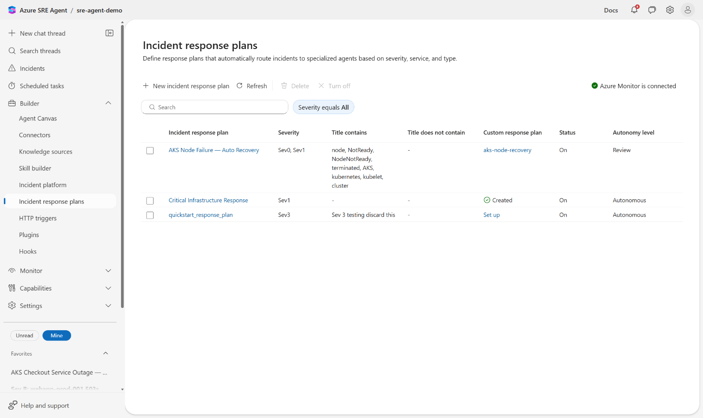

### What You See

The incident response plans page shows a grid with:
- **Plan name** — Descriptive name for the response plan
- **Severity** — Which severity levels trigger this plan (Sev0, Sev1, Sev2, Sev3, Sev4)
- **Title match** — Keywords in the incident title that activate this plan
- **Handler** — Which agent handles the incident
- **Mode** — "Review" (human approval) or "Autonomous" (auto-execute)

### Our Demo Plans

| Plan | Severity | Keywords | Handler | Mode |
|------|----------|----------|---------|------|
| AKS Node Failure — Auto Recovery | Sev0, Sev1 | "AKS", "node", "kubernetes" | aks-node-recovery | Review |

### Creating a Plan

1. Navigate to **Builder > Incident response plans**
2. Click **+ Create plan**
3. Set the plan name, severity levels, and title keywords
4. Select the handler agent
5. Choose the execution mode (Review or Autonomous)
6. Click **Save**

### 📁 Repo Mapping

| Portal Element | Repo File |
|---------------|-----------|
| P1 Database Critical plan | `agent/incident-response/p1-database-critical.yaml` |
| P1 API Outage plan | `agent/incident-response/p1-api-outage.yaml` |
| P2 Performance Degradation plan | `agent/incident-response/p2-performance-degradation.yaml` |
| P3 Cost Anomaly plan | `agent/incident-response/p3-cost-anomaly.yaml` |

---

## 7. HTTP Triggers

**HTTP Triggers** expose webhook endpoints that external systems can call to invoke the SRE Agent.

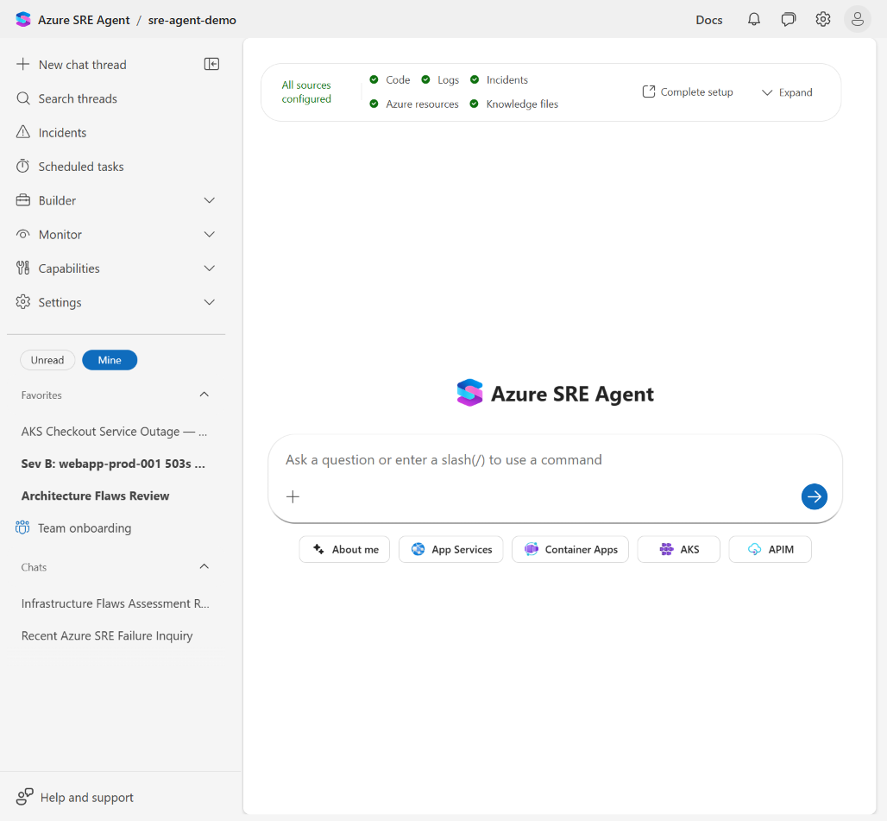

### What You See

The HTTP triggers page shows:
- A list of configured webhook endpoints
- Each trigger has a unique URL, authentication method, and target action
- Triggers can invoke agents, skills, or workflows

### Use Cases

| Trigger | Source | Purpose |
|---------|--------|---------|
| Azure Monitor Alert Handler | Azure Monitor Action Groups | Forward alerts to SRE Agent for investigation |
| Post-Deploy Verification | CI/CD pipeline (GitHub Actions, ADO) | Trigger health checks after deployment |
| External Monitoring Webhook | Datadog, Grafana, PagerDuty | Receive alerts from third-party monitoring |

### How to Configure

1. Navigate to **Builder > HTTP triggers**
2. Click **+ Create trigger**
3. Configure the trigger:
   - **Name** and **description**
   - **Authentication** method (API key, Azure AD, none)
   - **Target** — which agent or skill to invoke
   - **Payload mapping** — how to extract data from the incoming webhook
4. Copy the generated webhook URL for use in your external system

### 📁 Repo Mapping

| Portal Element | Repo File |
|---------------|-----------|
| Azure Monitor alert handler | `agent/http-triggers/azure-monitor-alert-handler.yaml` |
| Post-deploy verification | `agent/http-triggers/post-deploy-verification.yaml` |

---

## 8. Plugins

**Plugins** extend the SRE Agent with community-built capabilities from a marketplace. They add new tools, connectors, and integrations.

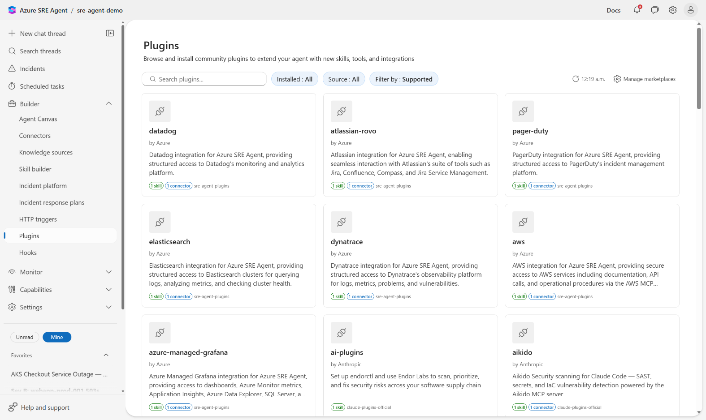

### What You See

The plugins page shows:
- **Plugin marketplaces** — curated collections of plugins
- **Available plugins** — browsable grid of community extensions
- **Installed plugins** — currently active plugins

### Available Plugin Marketplaces

| Marketplace | Publisher | Description |
|------------|-----------|-------------|
| Azure SRE Agent Plugins | Azure/sre-agent-plugins | Official Microsoft-curated plugins |
| Claude Plugins Official | anthropics/claude-plugins-official | Anthropic community plugins |

### Notable Plugins

| Plugin | Description |
|--------|-------------|
| **Datadog Integration** | Pull metrics and logs from Datadog |
| **Atlassian Rovo** | Connect to Jira and Confluence |
| **PagerDuty** | Manage incidents and on-call schedules |
| **Elasticsearch** | Query Elasticsearch/OpenSearch clusters |
| **Dynatrace** | APM and infrastructure monitoring |
| **AWS** | Cross-cloud operations for hybrid environments |
| **Azure Managed Grafana** | Dashboard and alerting integration |

### Installing a Plugin

1. Navigate to **Builder > Plugins**
2. Browse or search the marketplace
3. Click on a plugin to see details
4. Click **Install** — the plugin may require:
   - A matching MCP connector to be configured first
   - API keys or credentials for the external service
5. The plugin's tools and capabilities become available to the agent

---

## 9. Hooks

**Hooks** add pre-action and post-action checks to the agent's workflow. They act as guardrails — validating actions before execution or logging them after.

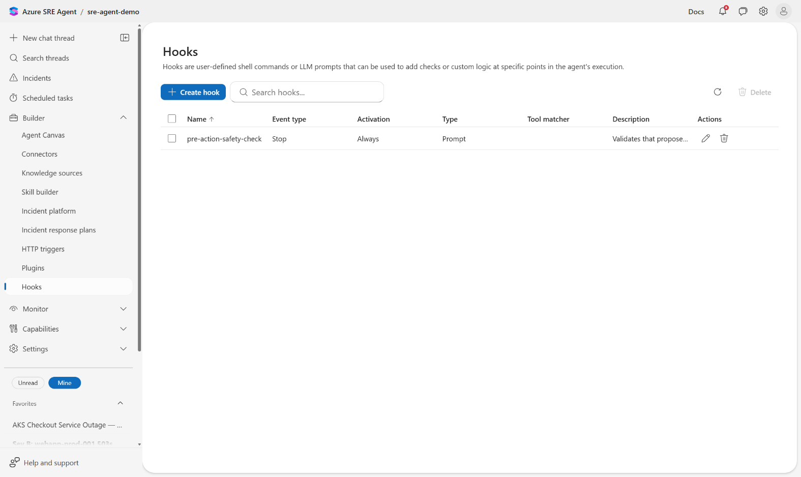

### What You See

The hooks page shows configured hooks with:
- **Hook name** — descriptive identifier
- **Type** — Prompt (LLM-based evaluation) or Shell (command execution)
- **Event** — Stop (pre-action) or Continue (post-action)
- **Mode** — Always, Conditional, or Manual

### Our Demo Hook

| Hook | Type | Event | Mode | Description |
|------|------|-------|------|-------------|
| pre-action-safety-check | Prompt | Stop | Always | Evaluates every action for safety before execution |

### Hook Configuration Options

| Setting | Values | Description |
|---------|--------|-------------|
| **Hook type** | Prompt, Shell | Prompt uses an LLM to evaluate; Shell runs a command |
| **Event type** | Stop (pre-action), Continue (post-action) | When the hook fires |
| **Activation mode** | Always, Conditional, Manual | How often the hook runs |
| **Model** | Reasoning Fast (default), others | Which AI model evaluates (for Prompt type) |
| **Timeout** | 30s (default) | Max execution time |
| **Fail mode** | Allow, Block | What happens if the hook times out |
| **Max rejections** | 1–25 (default: 3) | How many times the hook can reject before overriding |

### How to Create

1. Navigate to **Builder > Hooks**
2. Click **+ Create hook**
3. Choose the hook type (Prompt or Shell)
4. Write the evaluation prompt or shell command
5. Set the event type, activation mode, and parameters
6. Click **Save**

### 📁 Repo Mapping

| Portal Element | Repo File |
|---------------|-----------|
| Pre-action safety check | `agent/hooks/pre-action-safety-check.yaml` |
| Post-action audit log | `agent/hooks/post-action-audit-log.yaml` |

---

## 10. Scheduled Tasks

**Scheduled Tasks** run the agent on a cron schedule for proactive monitoring, health checks, and reporting.

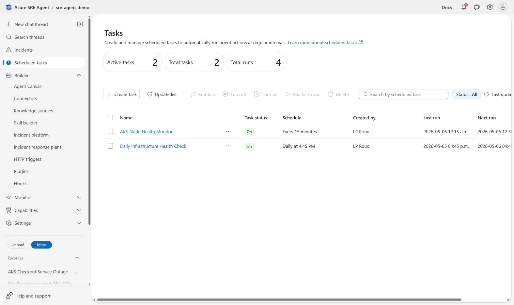

### What You See

The scheduled tasks page shows:
- **Task list** — all configured scheduled tasks with their status
- **Active count** — how many tasks are currently enabled
- **Total runs** — cumulative execution count
- **Cron schedule** — when each task runs
- **Last run / Next run** — execution timestamps

### Our Demo Tasks

| Task | Schedule | Handler | Mode |
|------|----------|---------|------|
| AKS Node Health Monitor | Every 15 minutes | aks-node-recovery | Autonomous |
| Daily Infrastructure Health Check | Daily at 4:45 PM | sre-agent-demo | Autonomous |

### Creating a Scheduled Task

1. Navigate to the **Scheduled tasks** section in the sidebar (or Builder)
2. Click **+ Create task**
3. Configure:
   - **Name** and **description**
   - **Cron expression** (e.g., `*/15 * * * *` for every 15 min)
   - **Handler agent** — which agent runs the task
   - **Mode** — Review (requires approval) or Autonomous (auto-execute)
   - **Instructions** — what the agent should do when triggered
4. Click **Save**

### 📁 Repo Mapping

| Portal Element | Repo File |
|---------------|-----------|
| Daily health check | `agent/scheduled-tasks/daily-health-check.yaml` |
| Cost anomaly detection | `agent/scheduled-tasks/cost-anomaly-detection.yaml` |
| Security posture review | `agent/scheduled-tasks/security-posture-review.yaml` |
| Deployment verification | `agent/scheduled-tasks/deployment-verification.yaml` |
| Weekly SLA report | `agent/scheduled-tasks/weekly-sla-report.yaml` |

---

## 11. Capabilities — Tools

The **Tools** section shows all tools available to the agent — built-in, MCP-connected, and custom.

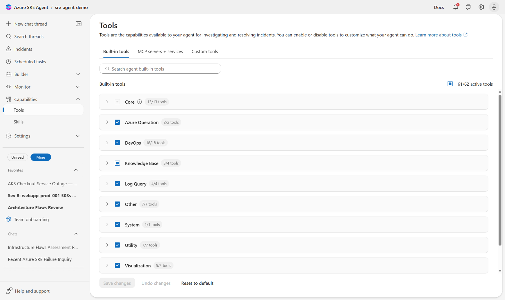

### What You See

The tools page has three tabs:
- **Built-in tools** — 61/62 active tools across 10 categories
- **MCP servers + services** — Tools from connected MCP servers (Datadog, Grafana, etc.)
- **Custom tools** — Your own KQL, Python, or HTTP tools

### Built-in Tool Categories

| Category | Count | Examples |
|----------|-------|---------|
| **Core** | 13 | Azure Resource Graph, ARM operations, resource management |
| **Azure Operation** | 2 | Azure CLI, Azure PowerShell execution |
| **DevOps** | 18 | Git operations, CI/CD pipeline management, PR reviews |
| **Knowledge Base** | 3-4 | Document search, knowledge retrieval |
| **Log Query** | 4 | KQL execution, log analytics, Application Insights queries |
| **Other** | 7 | Web search, HTTP calls, file operations |
| **System** | 1 | System diagnostics and health checks |
| **Utility** | 7 | JSON parsing, regex, math, date/time utilities |
| **Visualization** | 5 | Chart generation, dashboard rendering, Mermaid diagrams |
| **Workspace Operation** | 1 | Workspace management and configuration |

### Enabling/Disabling Tools

Each tool has a toggle switch. You can:
- **Disable** tools the agent shouldn't use (e.g., disable Azure CLI for read-only agents)
- **Enable** tools that are off by default
- See the tool's description and input schema

### Custom Tools

To add custom tools:
1. Click the **Custom tools** tab
2. Click **+ Add tool**
3. Choose the tool type:
   - **KQL Query** — Kusto queries for log analysis
   - **Python Script** — Custom Python scripts for calculations
   - **HTTP** — API calls to external services
4. Paste or upload your tool code
5. Define input parameters and output format

### 📁 Repo Mapping

| Portal Element | Repo File |
|---------------|-----------|
| Error log analyzer (KQL) | `agent/tools/kusto/error-log-analyzer.kql` |
| Performance baseline (KQL) | `agent/tools/kusto/performance-baseline.kql` |
| Deployment tracker (KQL) | `agent/tools/kusto/deployment-tracker.kql` |
| Resource health check (KQL) | `agent/tools/kusto/resource-health-check.kql` |
| SLA calculator (Python) | `agent/tools/python/sla-calculator.py` |
| Cost anomaly detector (Python) | `agent/tools/python/cost-anomaly-detector.py` |
| Certificate expiry checker (Python) | `agent/tools/python/certificate-expiry-checker.py` |
| Webhook notifier (HTTP) | `agent/tools/http/webhook-notifier.py` |

---

## 12. Capabilities — Skills

The **Skills** section shows all skills the agent can use — built-in skills and your custom skills.

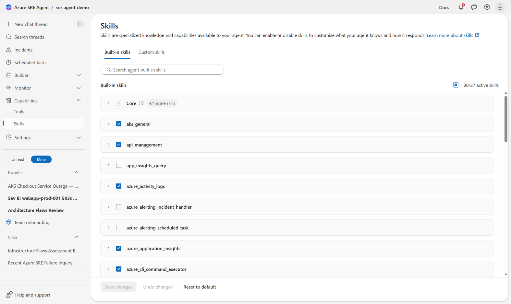

### What You See

The skills page has two tabs:
- **Built-in skills** — 30/37 active skills
- **Custom skills** — Your skills created in the Skill Builder

### Built-in Skill Categories

| Skill | Description |
|-------|-------------|
| **Core** (4 skills) | Fundamental agent capabilities |
| **aks_general** | AKS cluster management and troubleshooting |
| **api_management** | Azure API Management diagnostics |
| **azure_activity_logs** | Activity log analysis and auditing |
| **azure_application_insights** | Application performance monitoring |
| **azure_cli_command_executor** | Safe Azure CLI command execution |
| **cannot_connect_to_vm** | VM connectivity troubleshooting |
| **cdb_general** | Cosmos DB diagnostics |
| **code_repository_management** | Git/GitHub/ADO operations |
| **container_apps** | Azure Container Apps management |
| **diagnostic_cpu** | CPU performance investigation |
| **diagnostic_memory** | Memory usage analysis |
| **frontend-design** | Frontend artifact design and generation |
| **function_app** | Azure Functions troubleshooting |
| **learn** | Documentation search and learning |
| **local_auth** | Authentication and authorization checks |
| **logic_app** | Azure Logic Apps troubleshooting |
| **logs_resource_discovery** | Discover log-producing resources |
| **metrics_and_chart_visualization** | Metrics querying and visualization |
| **pagerduty_incident_management** | PagerDuty integration operations |
| **postgresql** | PostgreSQL diagnostics |
| **redis** | Azure Redis Cache troubleshooting |
| **servicenow_incident_management** | ServiceNow integration |
| **tls_minimum_version_upgrade** | TLS version analysis and upgrade guidance |
| **web_app_down** | Web app outage investigation |
| **web_app_restart** | Safe web app restart procedures |
| **web_artifacts_builder** | Generate HTML/web report artifacts |

### Enabling/Disabling Skills

Like tools, each skill has a toggle. Disabled skills (7 by default) include specialized skills that may not be relevant to all environments.

---

## 13. Monitor — Session Insights

The **Monitor** section provides observability into the agent's actions, decisions, and performance.

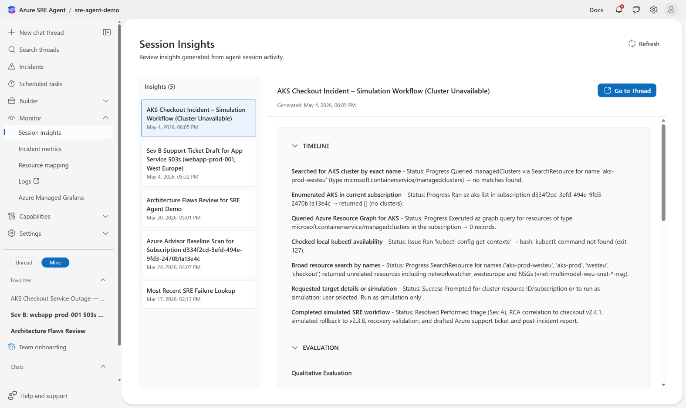

### What You See

The session insights page shows:
- **Session list** — recent agent sessions with timestamps
- **Timeline** — step-by-step view of what the agent did
- **Evaluation** — assessment of the agent's performance
- **Derived Learning** — patterns the agent identified for future use

### Monitor Sections

| Section | Description |
|---------|-------------|
| **Session insights** | Detailed view of individual agent sessions |
| **Incident metrics** | Aggregated metrics: MTTD, MTTR, resolution rates |
| **Resource mapping** | Which Azure resources the agent has access to |
| **Logs** | Raw agent execution logs for debugging |
| **Azure Managed Grafana** | Dashboards for agent performance visualization |

### Using Session Insights

1. Navigate to **Monitor > Session insights**
2. Click on a session to expand it
3. Review the **Timeline** tab to see each step the agent took
4. Check **Evaluation** for quality assessment
5. Review **Derived Learning** to see patterns the agent discovered

---

## 14. Builder Navigation Overview

The **Builder** section is the primary configuration surface. Here's how the full left sidebar navigation is organized:

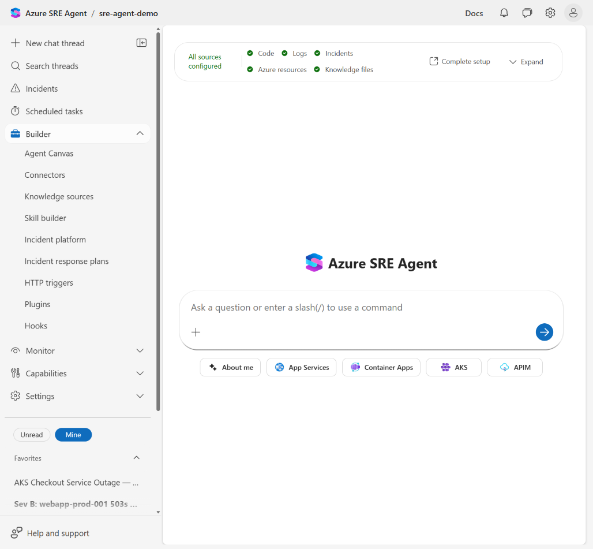

### Full Navigation Structure

```
Left Sidebar:
├── + New chat thread          ← Start a new conversation with the agent
├── 🔍 Search threads          ← Find past conversations
├── ⚠️ Incidents               ← View and manage active incidents
├── ⏰ Scheduled tasks          ← Manage proactive monitoring schedules
├── 🏗️ Builder                 ← Configuration surface
│   ├── Agent Canvas           ← Visual workflow designer
│   ├── Connectors             ← External service integrations
│   ├── Knowledge sources      ← Upload docs, link repos
│   ├── Skill builder          ← Create custom skills
│   ├── Incident platform      ← Connect incident management
│   ├── Incident response plans← Define severity routing
│   ├── HTTP triggers          ← Webhook endpoints
│   ├── Plugins                ← Marketplace extensions
│   └── Hooks                  ← Pre/post action guardrails
├── 📊 Monitor                 ← Observability
│   ├── Session insights       ← Agent session details
│   ├── Incident metrics       ← MTTD, MTTR, resolution rates
│   ├── Resource mapping       ← Azure resource access map
│   ├── Logs                   ← Execution logs
│   └── Azure Managed Grafana  ← Performance dashboards
├── ⚙️ Capabilities            ← Tool and skill management
│   ├── Tools                  ← 61+ built-in + custom tools
│   └── Skills                 ← 30+ built-in + custom skills
└── ⚙️ Settings                ← Agent configuration
    ├── Basics                 ← Name, model, description
    ├── Managed resources      ← Infrastructure resources
    ├── Azure settings         ← Subscription, resource group
    └── Agent consumption      ← Usage and billing
```

### Tips for Navigation

- **Builder** is where you spend 90% of your configuration time
- **Capabilities** controls what tools and skills the agent can access
- **Monitor** is where you review the agent's work and tune performance
- **Settings** manages the underlying infrastructure and billing

---

## Quick Reference: Portal → Repo File Mapping

| Portal Section | Repo Directory | File Pattern |
|---------------|----------------|--------------|
| Agent Canvas (custom agents) | `agent/custom-agents/` | `*.yaml` |
| Connectors | `agent/connectors/` | `*.yaml` |
| Knowledge sources | `agent/knowledge/` | `*.md` |
| Skill builder | `agent/skills/` | `*/SKILL.md` |
| Incident response plans | `agent/incident-response/` | `*.yaml` |
| HTTP triggers | `agent/http-triggers/` | `*.yaml` |
| Hooks | `agent/hooks/` | `*.yaml` |
| Scheduled tasks | `agent/scheduled-tasks/` | `*.yaml` |
| Custom tools (KQL) | `agent/tools/kusto/` | `*.kql` |
| Custom tools (Python) | `agent/tools/python/` | `*.py` |
| Custom tools (HTTP) | `agent/tools/http/` | `*.py` |
| Workflows | `agent/workflows/` | `*.yaml` |

---

## How to Use This Repository

1. **Deploy infrastructure** — Run `azd up` to provision Log Analytics, App Insights, UAMI, and RBAC
2. **Create the SRE Agent** — In Azure Portal, create a new SRE Agent resource in your resource group
3. **Follow the Setup Guide** — See [`docs/SETUP-GUIDE.md`](SETUP-GUIDE.md) for step-by-step portal configuration
4. **Upload knowledge files** — Drag-and-drop files from `agent/knowledge/` into Knowledge Sources
5. **Create custom agents** — Paste YAML definitions from `agent/custom-agents/` into Agent Canvas
6. **Add skills** — Upload `SKILL.md` files from `agent/skills/` into Skill Builder
7. **Configure connectors** — Use templates from `agent/connectors/` as reference
8. **Set up incident response** — Create plans using `agent/incident-response/` as templates
9. **Schedule proactive tasks** — Configure tasks from `agent/scheduled-tasks/`
10. **Enable hooks** — Add guardrails from `agent/hooks/`
11. **Test everything** — Use the Test Playground on the Agent Canvas
